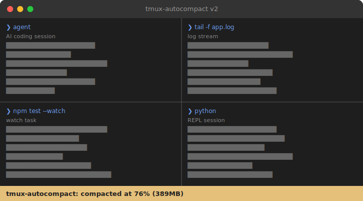

# tmux-autocompact



tmux stores pane history inside the tmux server process. Output-heavy panes can grow that RSS until the machine starts swapping or other work gets killed.

`tmux-autocompact` is model-agnostic and workload-agnostic. It only watches tmux server RSS. When the compact point is reached, it clears pane history. Sessions, panes, windows, and child processes keep running.

The default RSS budget is `256MB`. Autocompaction starts at `75%` of that budget, so the default compact point is `192MB`.

## Install

The repository contains two scripts:

- `tmux-autocompact`: background monitor
- `tmux-autocompact-clear`: immediate manual compaction

```bash
cp tmux-autocompact tmux-autocompact-clear ~/.local/bin/
chmod +x ~/.local/bin/tmux-autocompact ~/.local/bin/tmux-autocompact-clear
```

Add the following to `~/.tmux.conf`:

```bash
set -g history-limit 3000
set-hook -g session-created 'run-shell -b "pgrep -f \"$HOME/.local/bin/tmux-autocompact 256\" >/dev/null || \"$HOME/.local/bin/tmux-autocompact 256\""'
```

Reload tmux, or start the monitor immediately:

```bash
tmux source-file ~/.tmux.conf
tmux run-shell -b "$HOME/.local/bin/tmux-autocompact 256"
```

## How it works

- `tmux-autocompact` checks tmux server RSS every `60` seconds.
- It compacts when RSS reaches `75%` of the configured budget.
- The default invocation `tmux-autocompact 256` starts compacting at `192MB`.
- `tmux-autocompact-clear` clears history immediately.

## Manual use

```bash
tmux-autocompact-clear
tmux-autocompact 128
```

`tmux-autocompact 128` starts compacting at `96MB`.

## Scope

- Scrollback is removed.
- Running processes are not stopped.
- tmux sessions, windows, and panes are not removed.

## Uninstall

Remove the hook from `~/.tmux.conf`, then delete the installed scripts:

```bash
rm ~/.local/bin/tmux-autocompact ~/.local/bin/tmux-autocompact-clear
```
